# React Restaurant Shopping Cart
React SSR+Redux+Postgresql or MySQL +Webpack+Nodejs

### Demo

<a href="https://reactreduxrestaurant.herokuapp.com">https://reactreduxrestaurant.herokuapp.com</a>

## User Interfaces

### Home Page
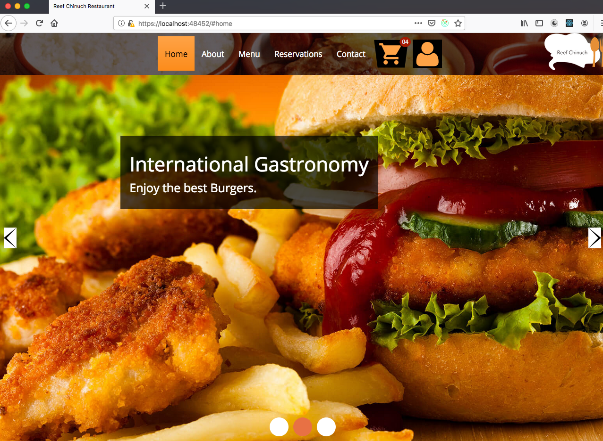

### Menu
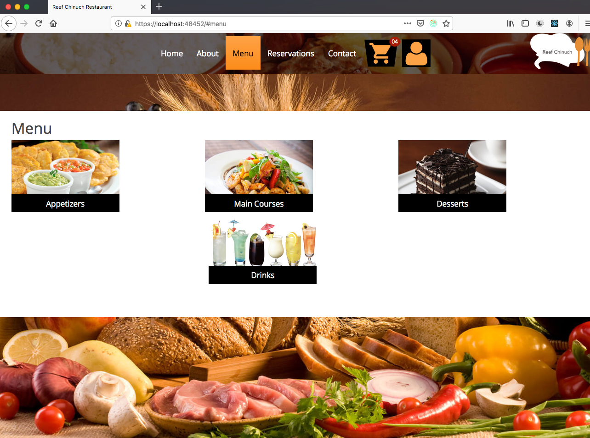

### View Main Courses
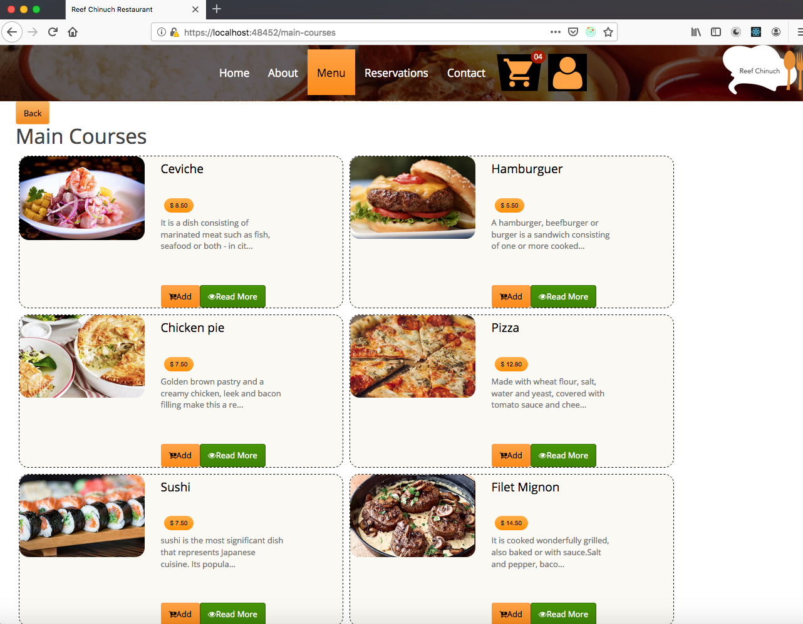

### View Main Course Description
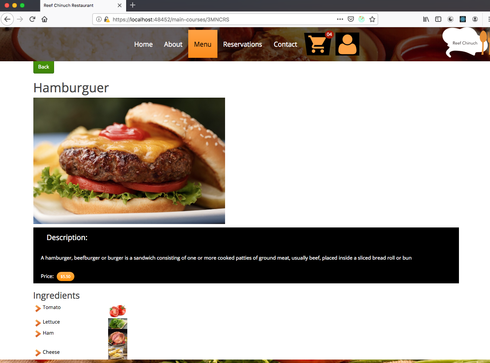

### Add Dish to Cart 
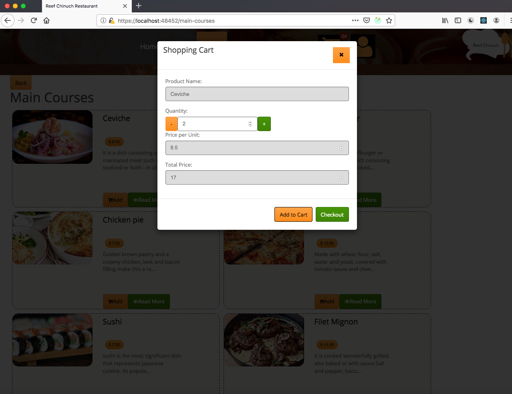

### Shopping Cart
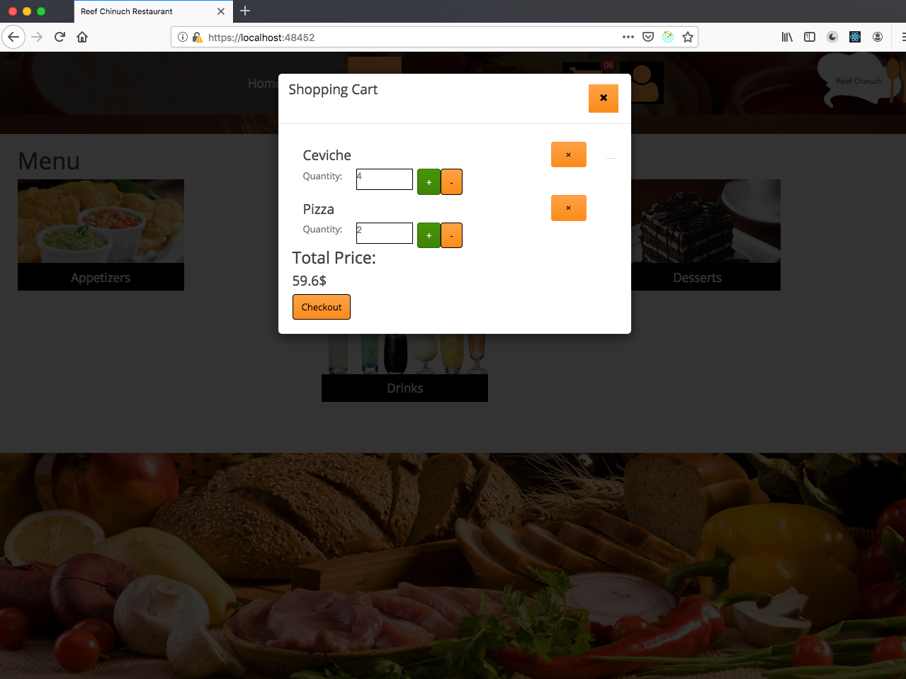

### Login 
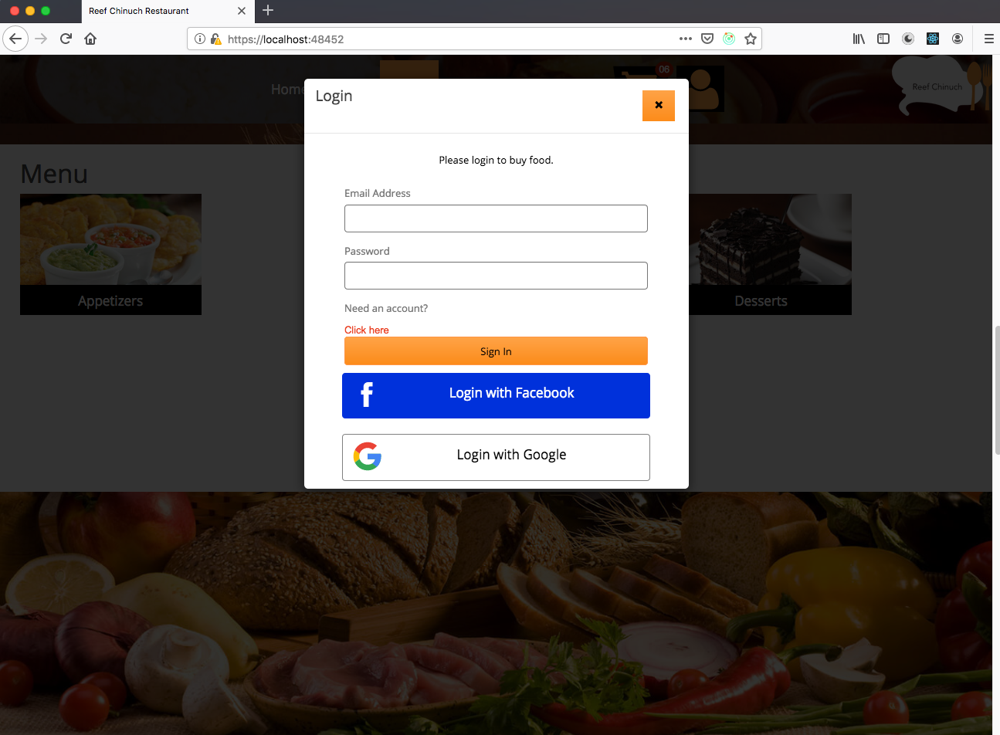

### User Profile
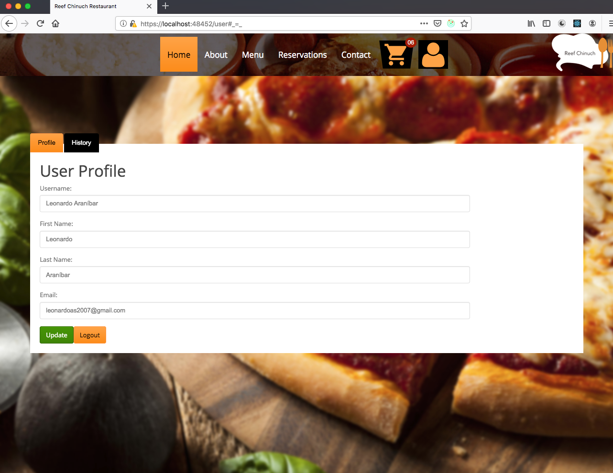

### User History
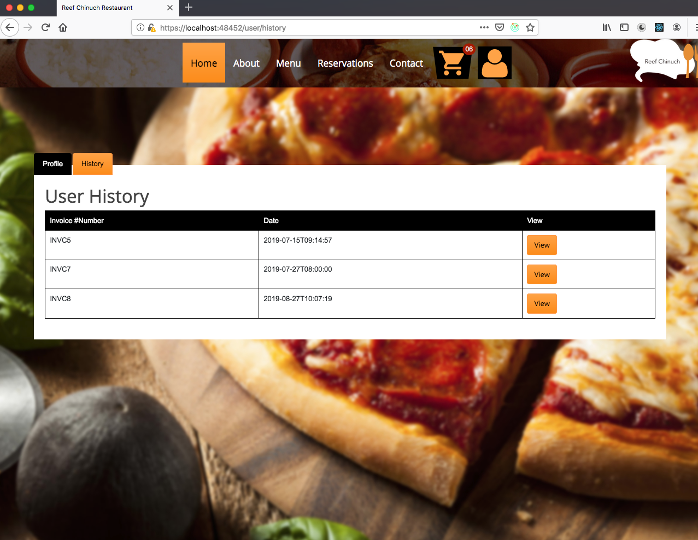

### View Invoice
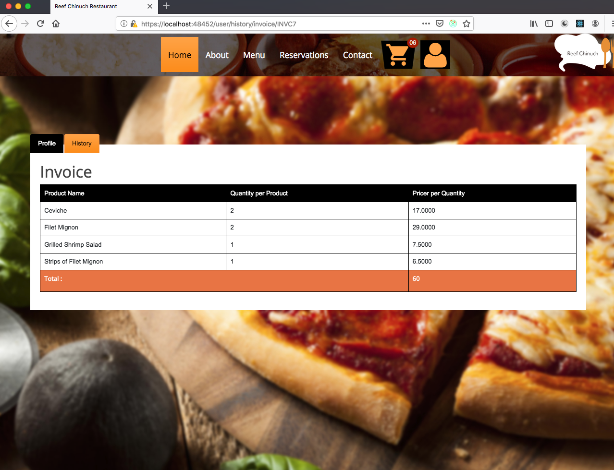

### Checkout
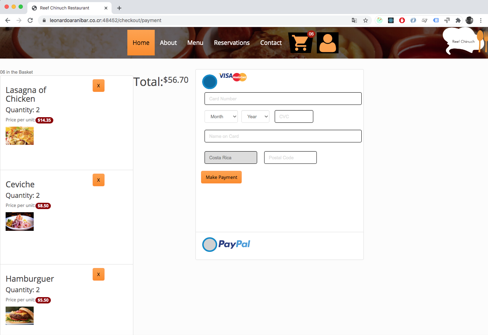

### Checkout - Pay with Paypal
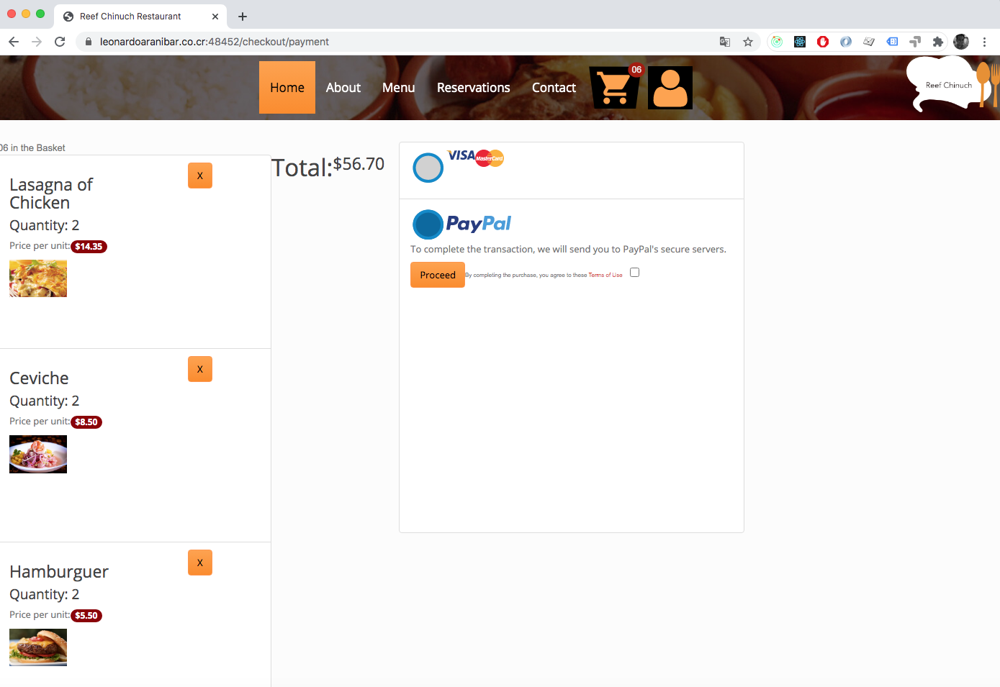

## Available Scripts

In the project directory, you can run:

### `npm start`

Runs the app in the development mode. 
Open [https://localhost:48452](https://localhost:48452) to view it in the browser.

### `npm run build`

Builds the app for production to the `build` folder. 
